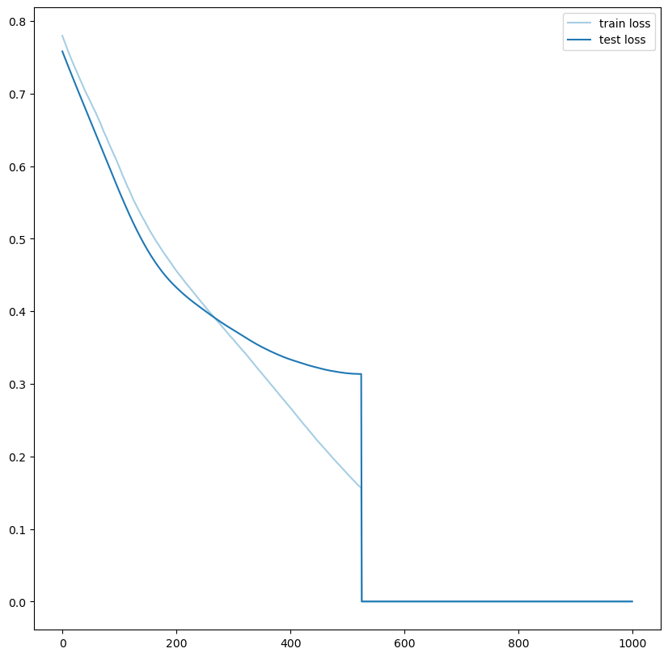

<div align="center">

# 🚀 RL-TBoost

### Reinforcement Learning Enhanced by Topological Data Analysis for Lung Transplant Mortality Prediction

[](https://choosealicense.com/licenses/gpl-3.0/)
[](https://www.python.org/)
[](https://www.tensorflow.org/)
[](https://giotto-ai.github.io/gtda-docs/)
[](https://colab.research.google.com/github/MorillaLab/RL-TBoost/blob/main/pulmonary_transplantation.ipynb)

**RL-TBoost** is a novel Reinforcement Learning framework where the agent's reward signal is grounded in **topological data analysis** — training stops not when loss plateaus, but when the *topological shape* of the dataset is no longer preserved between epochs. Applied to Year-1 mortality risk prediction after lung transplantation.

[📄 Overview](#-overview) · [🚀 Quick Start](#-quick-start) · [🏗️ Architecture](#️-architecture) · [🔬 The RL Loop](#-the-rl-loop) · [📊 Results](#-results)

</div>

---

## 🔍 Overview

Standard deep learning training relies on loss minimisation as its sole stopping criterion — but loss alone cannot capture whether the model has preserved the *geometric and topological structure* of the data. This matters especially in clinical settings where the distribution of high-risk vs. low-risk patients has complex, non-linear boundaries.

**RL-TBoost** addresses this with a custom TensorFlow RL environment where:

- The **state** encodes the model's current accuracy, built on invariant multiscale TDA features of the patient dataset
- The **reward** is maximised only when the topological shape of the dataset is preserved (new loss < previous loss)
- The **agent** dynamically decides whether to keep training (Action 0) or stop (Action 1) based on this topological criterion

This creates a training loop that is simultaneously guided by predictive performance *and* geometric faithfulness to the data's underlying structure.

<p align="center">
  
  <br/>
  <em>RL-TBoost training performance: topologically-guided RL loop preserves dataset shape across epochs.</em>
</p>

<p align="center">
  
  <br/>
  <em>RL-TBoost training performance: topologically-guided RL loop preserves dataset shape across epochs.</em>
</p>

---

## 🏗️ Architecture

```
Clinical Dataset (lung transplant patients)
          │
          ▼
┌─────────────────────────┐
│  Representation Learning│  ← Invariant multiscale TDA features
│  (Topological Features) │    (persistent homology, Betti numbers)
└─────────────┬───────────┘
              │
              ▼
┌─────────────────────────────────────────────┐
│         Custom TensorFlow RL Environment    │
│                                             │
│  State:   model accuracy + TDA feature loss │
│                                             │
│  Actions:                                   │
│    Action 0 → Continue training             │
│    Action 1 → Terminate current round       │
│                                             │
│  Reward:  maximise test accuracy            │
│           subject to: loss(n) < loss(n-1)   │
│           [topological shape preservation]  │
└─────────────────────────────────────────────┘
              │
              ▼
┌─────────────────────────┐
│  Deep Learning Model    │
│  (TDA-enhanced)         │
│  Y1 mortality prediction│
└─────────────────────────┘
              │
              ▼
    Risk stratification 🫁
    (Y1 post-transplant mortality)
```

### Three-Module Structure

The repository is organised into three analysis streams that mirror the three conceptual phases of the framework:

| Module | Folder | Description |
|---|---|---|
| **Cohort Analysis** | `Cohort_analysis/` | Patient cohort characterisation, survival analysis |
| **Representation Learning** | `Representation_Learning/` | TDA feature extraction, multiscale topological representations |
| **RL Model** | `Reinforcement_Learning_Model/` | Custom TF environment, agent training, performance evaluation |

---

## 🔬 The RL Loop

The core innovation is using topological shape preservation as a *training criterion* rather than an ad-hoc stopping rule:

```
Epoch n
  │
  ▼
Compute loss(n) on test set
  │
  ├── loss(n) < loss(n-1)?
  │        │
  │      YES → Shape preserved → Reward agent → Action 0 (continue)
  │        │
  │       NO → Shape violated → No reward   → Action 1 (terminate)
  │
  ▼
Agent updates policy (maximise accuracy)
```

**Why TDA?** Persistent homology extracts features that are *invariant to continuous deformations* of the dataset — small perturbations in patient measurements don't change the topological signature. This makes the reward signal robust to noise and measurement variability, which is critical in clinical ICU data.

---

## 📊 Results

RL-TBoost was validated on lung transplant patient data for **Year-1 (Y1) mortality prediction**:

- Custom RL environment built with TensorFlow
- TDA features derived from patient clinical trajectories
- Topological shape preservation used as the convergence criterion
- Cohort analysis performed on the full patient population

See `Reinforcement_Learning_Model/RL-TBoost_performance.png` for training curves and `Cohort_analysis/` for cohort characterisation.

---

## 🚀 Quick Start

### Installation

```bash
git clone https://github.com/MorillaLab/RL-TBoost.git
cd RL-TBoost
pip install -r requirements.txt
```

### Run the main notebook

```bash
jupyter notebook pulmonary_transplantation.ipynb
```

Or launch in Colab:

[](https://colab.research.google.com/github/MorillaLab/RL-TBoost/blob/main/pulmonary_transplantation.ipynb)

### Run individual modules

```bash
# Step 1 — Cohort analysis
jupyter nbconvert --to notebook --execute Cohort_analysis/*.ipynb

# Step 2 — Representation learning (TDA features)
jupyter nbconvert --to notebook --execute Representation_Learning/*.ipynb

# Step 3 — RL model training
jupyter nbconvert --to notebook --execute Reinforcement_Learning_Model/*.ipynb
```

### Python API sketch

```python
from utilities.tda_features import extract_topological_features
from Reinforcement_Learning_Model.rl_environment import RLTBoostEnv
import tensorflow as tf

# Extract TDA features from clinical data
X_tda = extract_topological_features(patient_data)

# Build custom RL environment
env = RLTBoostEnv(X_tda, y_mortality)

# Train agent
agent = tf.keras.Sequential([...])  # your policy network
env.train(agent, epochs=100)

# Predict Y1 mortality risk
risk_scores = env.predict(X_test_tda)
```

---

## 📁 Repository Structure

```
RL-TBoost/
├── Cohort_analysis/                # Patient cohort characterisation & survival
├── Reinforcement_Learning_Model/   # Custom TF RL environment & agent
│   └── RL-TBoost_performance.png  # Training performance figure
├── Representation_Learning/        # TDA feature extraction
├── utilities/                      # Shared helper functions
├── pulmonary_transplantation.ipynb # Main analysis notebook
├── requirements.txt                # Python dependencies
└── LICENSE                         # GPL-3.0
```

---

## 🔗 Related MorillaLab Repositories

RL-TBoost is part of the lab's lung transplantation prediction research programme:

- **[TopoAttention](https://github.com/MorillaLab/TopoAttention)** — transformer + TDA for post-transplant mortality (Year-1+)
- **[TaelCore](https://github.com/MorillaLab/Taelcore)** — TDA-enhanced dimensionality reduction for transplant risk prediction
- **[GeoTop](https://github.com/MorillaLab/GeoTop)** — geometric-topological feature extraction (used in TDA pipeline)

---

## 🎈 Citation

If you use RL-TBoost in your research, please cite:

```bibtex
@software{morilla_rltboost_2024,
  author    = {Morilla, Ian and {MorillaLab}},
  title     = {RL-TBoost: Reinforcement Learning Enhanced by Topological
               Data Analysis for Lung Transplant Mortality Prediction},
  year      = {2024},
  publisher = {GitHub},
  url       = {https://github.com/MorillaLab/RL-TBoost}
}
```

---

## 🤝 Contributing

We welcome contributions — improvements to the RL environment, alternative TDA feature sets, new cohort datasets. Please open an issue before submitting a pull request. See [`CONTRIBUTING.md`](CONTRIBUTING.md) for guidelines.

---

## 📜 License

This project is licensed under the GNU General Public License v3.0 — see [`LICENSE`](LICENSE) for details.

---

<div align="center">
  Made with ❤️ by <a href="https://github.com/MorillaLab">MorillaLab</a>
  <br/>
  <sub>Reinforcement Learning · Topological Data Analysis · Lung Transplantation</sub>
</div>
